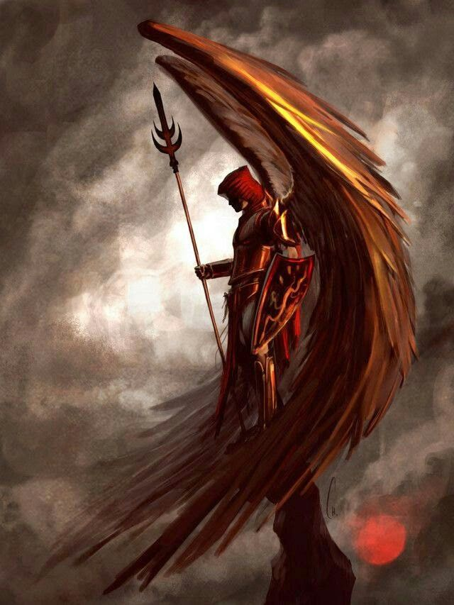

# Overview

## StoryLine 1: "Daimonic"

!!! info " "
    _The word "Demon" which we commonly know today, is derived from "Daemon"._

    _Daemon is the Latin word for the Ancient Greek of `daimon` (δαίμων: "god", "godlike", "power", "fate"), which originally referred to a lesser deity or guiding spirit such as the daemons of ancient Greek religion and mythology and of later Hellenistic religion and philosophy. The word is derived from Proto-Indo-European *daimon "provider, divider (of fortunes or destinies), "* from the root da- "to divide". Daimons were possibly seen as the souls of men of the golden age acting as tutelary deities, according to entry δαίμων at Liddell & Scott._

    _Additionally, For reference, BCE is short for Before Common Era. The Common Era begins with year 1 in the Gregorian calendar and is also known as the Western or Christian calendar._

### The First "Gods"

Generally the Oldest Deities are the Mesopotamian Gods.

The seven sages in Sumerian mythology sent to the earth by Anu (or Enki in some stories) at the beginning of time to give human beings the sacred 'me' (laws) of civilization. They were also known, by the Akkadians and Babylonians, as The Apkallu or the Apkallu Fish and are depicted with the body of a fish and the head of a man or with the torso of a fish and human arms, legs and head, sometimes with and sometimes without wings.  In the Babylonian tradition, the Apkallu also appear as Griffins or simply as humans with wings.

There are shrines to Enki dating back to the founding of the city of Eridu, considered by the Mesopotamians the first city established at the beginning of the world c. 5400 BCE.

_**None of the old Gods actually were divine though...**_

??? question "Huh, then what were they really?"
    Travelers from alternate dimensions and planes, space.   More importantly, they were usually opportunists and unscrupulous businessmen and merchants.   Just vasty overpowered compared to the native life here on Earth.   Also for some of them, Earth also acted as a penal colony, similar to the origins of Australia.

### Power/Level Development

-   Similar to Wuxia and Cultivation style with parts of software code development.  Stages of Development (10 sub-stages within each development level):

???+ example "Progression info"
    1.  **Stage 1: Body**
        1.  Primarily increasing body strength and development.   
        1.  Psychic and/or elemental abilities are very limited to usually single target with long cool down times (cannot be used again until refreshed).
    1.  **Stage 2: Mind**
        1.  Continuance of body refinement (Stage 1) for strength and agility, but a dramatic increase in inherent abilities.
        1.  Psychic & Elemental abilities may begin to cover small groups and have increased potency as well as increased range and frequency.
        1.  Most individuals are killed during this time.
        1.  Wings emerge after the 5th sub-stage.
    1.  **Stage 3: Spirit**
        1.  Continuance of mind refinement (Stage 2).
        1.  Daimonic Armor begins to get revealed.   
        1.  Individuals with Daimon armor are greatly respected and feared for toughness (tend to be very old)
    1.  **Stage 4: Ascended**
        1.  Drawn to conflict
        1.  Assembly of followers and aspects that would be considered 'Divine'
    1.  **Stage 5: Immortal**
    ---
    _**Example**: Rank 5 Body Refinement, Rank 2 Spirit Refiner_

### Ability Development

???+ example "Progression info"
    1.  **Stage 1: Body (Psychic Energy Manipulation gained)**
        1.  {{ extra.daimon.psy_energy_healing }} Self, but not {{ extra.daimon.psy_energy_healing }} Other until Rank 6 Body.  At-will, dependant on energy pool.
        1.  {{ extra.daimon.psy_energy_shield }} can only be used 1x per day (per sub-stage level)
        1.  {{ extra.daimon.psy_energy_manip_psy }} can only be used 1x per week (per sub-stage level)
        1.  {{ extra.daimon.psy_energy_manip_life }} can only be used 1x per month. Single Target only.
    1.  **Stage 2: Mind (Psychic Element Manipulation gained)**
        1.  All Psychic Energy Manipulation abilities, except {{ extra.daimon.psy_energy_manip_life }} can be used At-will, dependant on energy pool.
        1.  {{ extra.daimon.psy_energy_manip_life }} can be used 1x per week (per sub-stage level).  Single Target only.
            * _Special Limitation: The user must process & consolidate life energy gained within 24 hours or will catatonic for 48 hours_
        1.  Access to all Elemental types (ie. {{ extra.daimon.psy_elemental_list_all }}).  Elemental type rank cooresponds to sub-stage level).   
        1.  User cannot progress to the next sub-stage level unless elemental proficiency at each sub-stage level is achieved.
    1.  **Stage 3: Spirit**
        1.  {{ extra.daimon.psy_energy_manip_life }} can be used At-will, dependant on energy pool.  Single Target only.
        1.  Daimonic Armor gained resistances to users Elemental affinities (5% resistance per sub-stage Level).
        1.  Daimonic Weapons can channel a psychic ability ({{ extra.daimon.hero }} can channel {{ extra.daimon.psy_energy_manip_life }} through spear).
    1.  **Stage 4: Ascended**
        1.  {{ extra.daimon.psy_energy_manip_life }} can be used At-will, dependant on energy pool.  Multiple targets, Grouping is now possible.  This is perhaps the most feared ability and stage.   
        1.  Opposing Groups have been known to work together to destroy an Ascended {{ extra.daimon.psy_energy_manip_life }} user.
    1.  **Stage 5: Immortal**

Reference for girlfriend

### Chapter Highlights

???+ example "Highlights"
    1.  Intro to hero, {{extra.daimon.hero}}.
    1.  Intro to normal life for hero.
    1.  Witnessing the battle between {{extra.daimon.law_officer1}} and {{extra.daimon.badguy_class}}.
    1.  Helping turn the tide, but horribly wounded.  Also, {{extra.daimon.law_officer1}} does not survive.  
    1.  {{extra.daimon.hero}} inherits responsibilities, tech equipment, and AI assistant, named {{extra.daimon.ai_name}}.
    1.  "AI" in form of bracer on left forearm.  Can change shape & form.
    1.  Two  {{extra.daimon.badguy_class}}s enter the hospital to seize the AI and kill {{extra.daimon.hero}}
    1.  Escape via Psychic Energy Manipulation activation by draining of one of the {{extra.daimon.badguy_class}}s as fuel.  {{extra.daimon.psy_energy_manip_life}}.
        - However, The use of {{extra.daimon.psy_energy_manip_life}} causes additional conflicts.   
        - Some will believe It should not have been unlocked without binding oaths and punishments.
        - The reason for the fear is that using {{extra.daimon.psy_energy_manip_life}} and {{extra.daimon.psy_energy_manip_psy}} can add the target's skillset to the originators.
    1.  Part of conflict caught on hospital internal security video feed, and police/feds involved.  
    1.  Intro to villain, {{extra.daimon.villain}}.
    1.  Hunts other Daimons to equip those loyal to his faction.
    1.  Mindset is psychopathic corporate raider.  Targets other factions for tech and resources.
    1.  Pulls hospital video surveillance videos.
    1.  Starts to hunt {{extra.daimon.hero}}.  Wants to know, broker information and such.   
    1.  Seeks to learn how to create a {{extra.daimon.law_officer_class_elite}} daimon that is loyal/subservient to him.
    1.  {{extra.daimon.hero}} goes back home to visit family & friends.  
    1.  Discovers a previous girlfriend is also part-daimon (part of clan _{{extra.daimon.clan_name1}}_).  Small clan of elemental-type Daimon of Celtic background.  {{extra.daimon.myth_type8}}.
    1.  Learns of the term 'Daimon' and it's meaning.  Learns that his situation, while rare, is not unique.
    1.  She helps him and helps him realize his potential, and that having a personal AI is overpowered for him.   Also that he's potentially a {{law_officer_class_elite}} type daimon.
    1.  Learns {{extra.daimon.law_officer_class}}s are respected.  Appear as {{extra.daimon.myth_type1}}s, and most clans work with them as they tend to be fair and unbiased.
    1.  {{extra.daimon.hero}} learns there are whole communities of "Daimons."
    1.  Starts to train with {{extra.daimon.hero_girlfriend}} and her family.
    1.  Speak to other {{extra.daimon.myth_type8}} clans.  Offered job as a protector and guard.
    1.  Major assault on trying to remove {{extra.daimon.clan_name1}} and {{extra.daimon.clan_name5}} clans.
    1.  {{extra.daimon.psy_energy_manip_life}} and {{extra.daimon.psy_energy_manip_psy}} are used in the battle to remove assassin leader.
    1.  https://www.annunaki.org/enki-enlil/
Reference for guardian  

Footnotes

[^1]: https://en.wikipedia.org/wiki/Daemon_(classical_mythology)
[^2]: https://www.ancient.eu/Enki/
