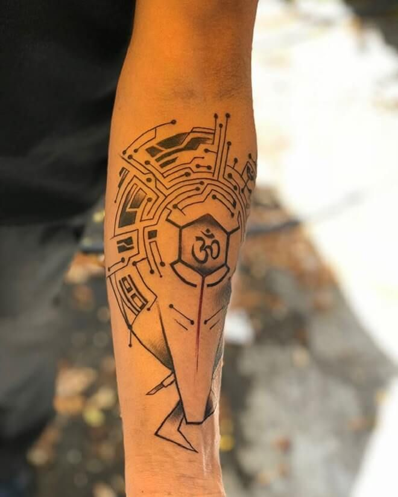
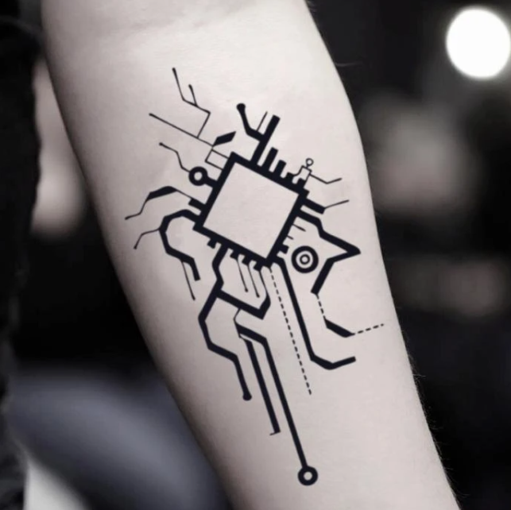
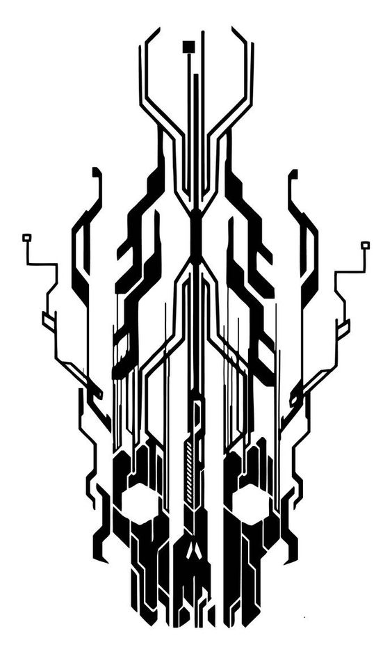
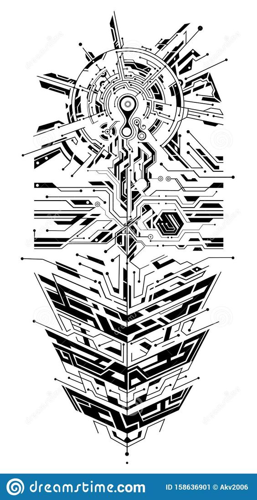
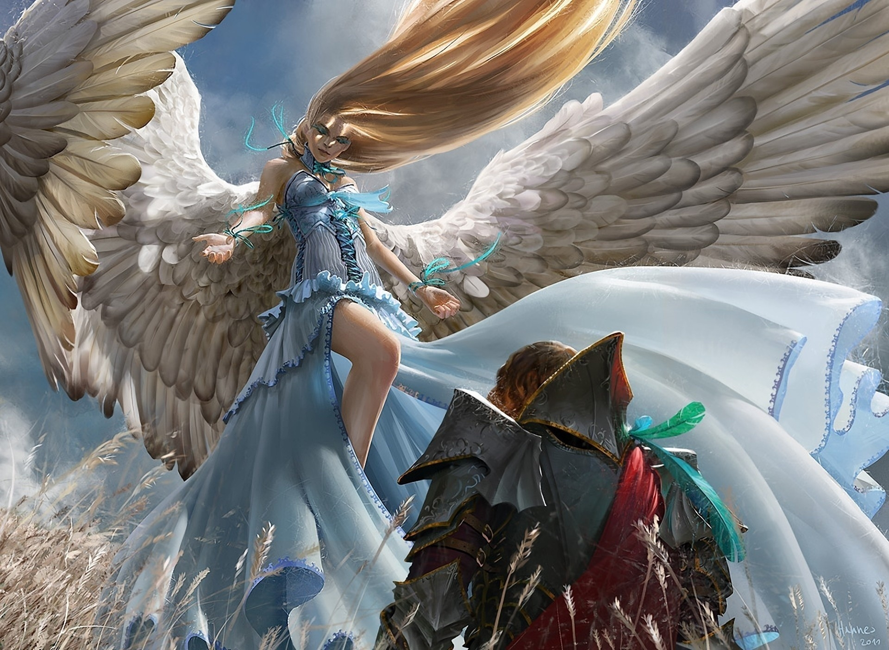
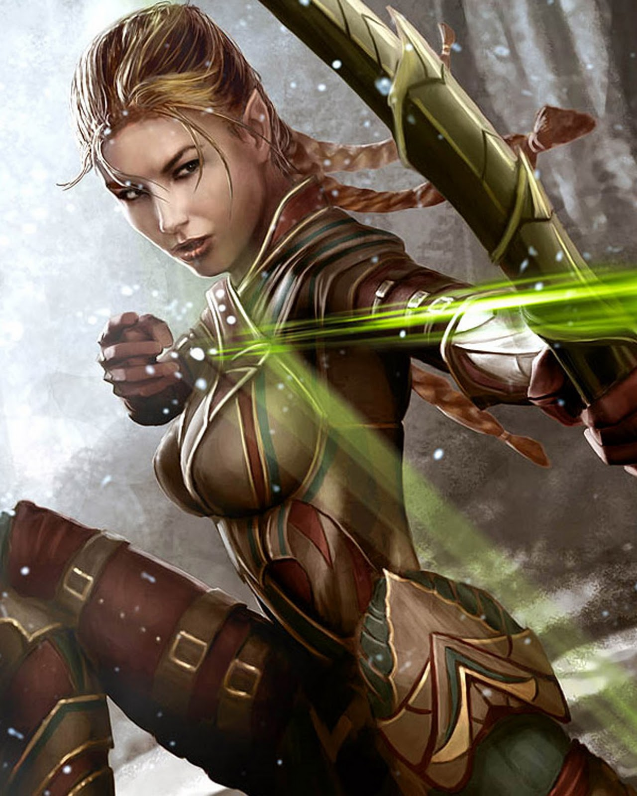
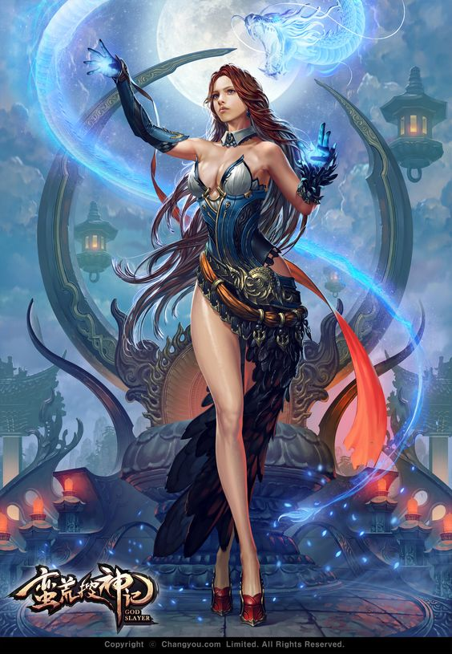
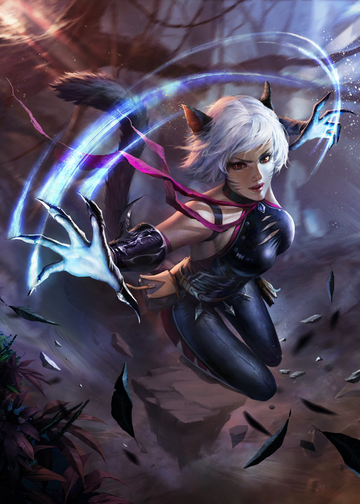

# Overview

## Daimon - Term origin and meaning

`Daimon` is the english translation of an Ancient Greek word `δαίμων`, which meant "god", or  "godlike", or "power" and "fate".

The more familiar word "Daemon", is the Latin translation of the Greek one.  A Daimon was originally referred to as a lesser deity or guiding spirit, such as the powers of ancient Greek religion and mythology and of later Hellenistic religion and philosophy.

The word also has origins from the Proto-Indo-European meaning "provider, divider (of fortunes or destinies)," from the root da- "to divide". Daimons were possibly believed to be the souls of men and women of the golden age acting as tutelary deities, according to entry `δαίμων` at Liddell & Scott.

This definition of Daimon is also in-line with ancient Indian literature and Vedic teachings of Asuras and Devas.  Several scholars assert that "If you read the Vedas, which are nearly 4000 years old, the word ‘asura’ does not mean demon, or villain, but quite the opposite, a divine being. It’s a title..."[^16]  

In summary, a daimon was believed to be a powerful or semi-divine entity, that acted as a protector, guardian, patron, teacher, and ruler in the ancient world.

## The First Gods

Generally the Oldest Deities are the Mesopotamian Gods.

The seven sages in Sumerian mythology sent to the earth by Anu (or Enki in some stories) at the beginning of time to give human beings the sacred 'me' (laws) of civilization. They were also known, by the Akkadians and Babylonians, as The Apkallu and are depicted with the body of a fish and the head of a man or with the torso of a fish and human arms, legs and head, sometimes with and sometimes without wings.  In the Babylonian tradition, the Apkallu also appear as Griffins or simply as humans with wings.

There are shrines to Enki dating back to the founding of the city of Eridu, considered by the Mesopotamians the first city established at the beginning of the world sometime between 5400 and 7000 BCE.

## Daimonic Influence on Cultures throughout History

### Minoan
!!! info ""
    The Minoan civilization was a Bronze Age Aegean civilization on the island of Crete and other Aegean Islands, flourishing from around 3000 BCE to 1450 BCE. The name "Minoan" derives from the mythical King Minos and was coined by Evans, who identified the site at Knossos with the labyrinth and the Minotaur.

    With Ship technology, the Minoans employed advanced construction methods using natural materials to create seaworthy composite hulls which would not be out-of-place in a modern-day marina[^7].  Additionally, Minoan shield technology was well before it's time and consisted of a shield with a wicker and resin inner subframe to absorb kinetic energy.  This wasn't seen again for thousands of years.

    Minoan civilization also had advanced water technologies, including indoor plumbing, running water, drainage systems, rainwater harvesting, and other technologies that are still in use today.

### Ancient Egypt
!!! info ""
    The ancient Egyptian civilization coalesced around 3100 BCE with the unification of Upper and Lower Egypt.   The ancient Egyptians would come to introduce mathematics, geometry, surveying, metallurgy, astronomy, accounting, writing, paper, medicine, the ramp, the lever, the plow, and mills for grinding grain to the general populace.

    They also were among the first people to keep records of dates, laws, proclamations, and other events to preserve there accuracy.

    Noteworthy, the Great Pyramid of Giza, built in 2500 BCE, has a perimeter of 1760 cubits and a height of 280 cubits – a ratio that's approximately twice pi.

    An approximate ratio for pi also appears in the Bible, in 1 Kings 7:23

### Inca
!!! info ""
    The Inca had many technologies, including Stone Cutting (which they were very good at), Agriculture, Astronomy, Mathematics, Medicine, Hydraulics, Architecture, Record-keeping, Finely-woven textiles and Military Tactics .

    They recorded their special events on Quipus, a series of knotted strings (quipu) for record keeping and communication.

    They had a major road system of over 16,000 miles, an extensive road network reaching all corners of the empire.

    One of the Incan more famous cities was Machu Picchu.  Despite the fact that Machu Picchu was built over 500 years ago, with no mortar used to hold together its stones, and sits up a mountain — on an earthquake fault! — the city’s 500 stone buildings are, amazingly, still standing today. Located 50 miles from Cusco, Machu Picchu measures an incredible 116 square miles in the Peruvian Andes, some 7,900 feet above sea level.  Even with the latest in 21st technology, scientists are baffled as to how Incas built this city without steel, mortar, or wheels.

### Osirian
!!! info ""
    History shows the Osirian civilization built huge earthquake-proof megalithic structures and had electricity and other conveniences common during the time of Atlantis. Only high technology of the Osirians could create the platform found at Baalbek, Lebanon. The main platform is composed of the largest hewn rocks in the world, the famous ashlars of Ba’albek.

    Some of the individual stones are 82 to 100 feet long and around 15 feet thick and are estimated to weigh anywhere between 1,200 and 1,500 tons each.

    It is widely accepted that there are more than 200 known sunken cities in the Mediterranean. Egyptian civilization, along with the Minoan and Mycenean in Crete and Greece are, in theory, remnants of Osirian culture. Like Atlantis and Rama, they also had airships and other modes of transport, often electrical in nature. The mysterious cart tracks of Malta, which go over cliffs and under water, may well be part of some ancient Osirian tram-line, possibly taking quarried stone to cities that are now submerged.

### Rama Empire
!!! info ""
    Believed to have existed around 10,000 BCE to 2,500 BCE.  The Rama Empire, described in the Mahabharata and Ramayana, was supposedly contemporaneous with the great cultures of Atlantis and Osiris in the West.

    The Mahabharata and the Drona Parva speak of the war and of the weapons used: great fireballs that could destroy a whole city; “Kapila’s Glance”, which could burn 50,000 men to ashes in seconds; and flying spears that could ruin whole “cities full of forts”[^9].

### Greek and Roman civilization
!!! info ""
    Both the Greek and Roman Empires were some of the most technologically advanced civilizations of antiquity.

    In Greece, inventions, such as lighthouses, clock towers, water mills, plumbing, and central heating were fairly common.  

    Rarer technological feats include Greek Fire (its creation is still elusive today), the Archimedes' Screw, and the Antikythera Mechanism, which is described as the oldest example of an analogue computer used to predict astronomical positions and eclipses decades in advance.

    In Ancient Rome, technological wonders included aqueducts, concrete, architecture, hydraulics, shipbuilding, and terraforming.   

    Also, Warfare was an essential aspect of both Roman society and culture.  As such, To combat physical injuries sustained in civilian and military spheres, the Romans innovated medical technologies, particularly surgical practices and techniques.

### Viking & Scandinavian
!!! info ""
    Known for Shipbuilding, solar stones, and strong, resistant swords.  Their warships were light and designed to be able to navigate up to one metre deep, so they could venture into rivers, marshes or approach the beach itself.

    They could know their location thanks to the Iceland spar, a type of calcite, which works as a polarizer, revealing a slight shine where the sun is

## Items and Inventions lost to time
???+ example "Top 8"
    1. <u>**Silphium**</u> - This extinct herb was edible, a preservative, was turned into a perfume and a condiment, it was an aphrodisiac, and it was used to treat a variety of medical conditions. The BBC says that it was very likely one of the first methods of birth control that actually worked.
    1. <u>**Damascus Steel**</u> -  swords of this metal could split a feather in midair, yet retain their edge through many a battle with the Saracens. The swords were easily recognized by a characteristic watery or 'damask' pattern on their blades.  With the advent of firearms, the secret was lost and never fully rediscovered.
    1. <u>**Organic Petrification by Girolamo Segato**</u> - Segato developed a technique similar to mummification, but unique: rather than simply removing water from cadavers, Segato's method consisted of what appears to be mineralization or "petrification". His particular technique permitted to save the original colors and features of the textures, besides their elasticity.  However, being labeled as "Egyptian magic", the church prompted him to destroy all his notes before his death.
    1. <u>**Dhaka Muslin**</u> - A lightweight, inexpensive, and transparent material made from cotton.  Made via an elaborate, 16-step process with a rare cotton that only grew along the banks of the holy Meghna river, the cloth was considered one of the great treasures of the age.  The British empire put a stranglehold on its production and wanted to corner the market, and legend says that the weavers of Dhaka muslin had their thumbs cut off so they could no longer weave.
    1. <u>**Roman concrete**</u> - Ancient Roman structures made from concrete aren't just standing, but they have withstood centuries of being battered by storms and, in some cases, ocean waves.  Additionally, researchers and geologists from the University of Utah have confirmed that ancient concrete isn't just holding strong, it's getting stronger.
    1. <u>**Starlite**</u> - Starlite is an intumescent material claimed to be able to withstand and insulate from extreme heat.  Under tests, Starlite was claimed to be able to withstand attack by a laser beam that could produce a temperature of 10,000 degrees Celsius.
    1. <u>**Greek Fire**</u> - Greek fire was an incendiary weapon used by the Byzantine Empire beginning 672 CE . Used to set fire to enemy ships, it consisted of a combustible compound emitted by a flame-throwing weapon. Some historians believe it could be ignited on contact with water, and was probably based on naphtha and quicklime. The Byzantines typically used it in naval battles to great effect, as it could supposedly continue burning while floating on water. The technological advantage it provided was responsible for many key Byzantine military victories, most notably the salvation of Constantinople from the first and second Arab sieges, thus securing the Empire's survival.
    1. <u>**Mithridatum**</u> - Mithridate, also known as mithridatium, mithridatum, or mithridaticum, is a semi-mythical remedy with as many as 65 ingredients, used as an antidote for any and all poisoning, and said to be created by Mithridates VI Eupator of Pontus in the 1st century BCE.

## Elemental Construct, or Runic, patterns
{width=30%, align=left}
{width=30%}

{width=30%, align=left}
{width=30%}

{width=30%, align=left}
{width=30%}

{width=30%}

## Useful Terms
`CE` is the acronym for Common Era.  The Common Era begins with year 1 in the Gregorian calendar and is also known as the Western or Christian calendar.  Considered the same as the terms anno Domini (AD).

`BCE` is the acronym for Before Common Era. Considered the same as the terms before Christ (BC).

## Chapter Highlights

!!! example "Highlights"
    1.  - [x] Intro to hero, {{extra.daimon.hero_fullname}}.
    1.  - [x] Intro to normal life for hero.
    1.  - [x] Witnessing the battle between {{extra.daimon.insurance_client_name}} and {{extra.daimon.myth_type0}} / {{extra.daimon.myth_type2}} team.
    1.  - [x] {{extra.daimon.hero}} inherits responsibilities, tech equipment, and AI assistant, named {{extra.daimon.ai_name}}.
    1.  - [x] "AI" in form of Embedded Gem and Tattoo on host.  Can change shape & form.
    1.  - [x] Meet {{extra.daimon.hero_friend_angel}} & clan heirs.
    1.  - [x] Wild Hunt issued against {{extra.daimon.hero_nickname}}.
    1.  - [ ] {{extra.daimon.hero}} fights outside home & ambushed.
    1.  - [ ] {{extra.daimon.hero}} hurt; {{extra.daimon.hero_friend_angel}} comes to his aid.  
    1.  - [ ] {{extra.daimon.hero_nickname}} learns about robberies and secret kidnappings.
    1.  - [ ] San Diego next on list for museum heist.
    1.  - [ ] {{extra.daimon.hero_nickname}} begins to alter/augment {{extra.daimon.hero_friend_angel}} nanite makeup.
    1.  - [ ] {{extra.daimon.hero_friend_triton}} introduction.
    1.  - [ ] {{extra.daimon.myth_type12}} artifacts on display; {{extra.daimon.hero_friend_triton}} arrives to ensure safety.
    1.  - [ ] {{extra.daimon.hero}} arrives & hopes to get answers.
    1.  - [ ] Museum raided; robbery stopped but {{extra.daimon.hero_friend_triton}} kidnapped.
    1.  - [ ] Last robber reveals Boston headquarters.
    1.  - [ ] {{extra.daimon.hero_nickname}} & {{extra.daimon.hero_friend_angel}} head to Boston.
    1.  - [ ] {{extra.daimon.clan_name19}} {{extra.daimon.myth_type8}} clan introduction.
    1.  - [ ] {{extra.daimon.hero_friend_mage}} introduction.
    1.  - [ ] Finds the robbery gang in Boston harbor; kidnapping victims on boat, artifacts in containers on wharf.
    1.  - [ ] {{extra.daimon.clan_name19}} clan engages the kidnappers to rescue clan members kidnapped; losing.
    1.  - [ ] {{extra.daimon.hero_nickname}} arrives and turns the tide of conflict.
    1.  - [ ] Ship assault rescues 25 others; 3 missing.
    1.  - [ ] {{extra.daimon.hero_nickname}} retreats; {{extra.daimon.hero_friend_triton}} freed; Her guard scuttles ship.
    1.  - [ ] {{extra.daimon.hero_friend_triton}} returns home; {{extra.daimon.hero_friend_mage}} returns home.
    1.  - [ ] Revelation that {{extra.daimon.hero_nickname}} is the target of the Wild Hunt; Divergent attitudes arise.
    1.  - [ ] {{extra.daimon.hero_nickname}} and {{extra.daimon.hero_friend_angel}} go to the Caribbean via Bermuda.
    1.  - [ ] Speculation on the kidnappings & who was really behind it.

## Reference images to understand characters

{width=800}

{width=800}

{width=800}

{width=800}

{width=800}

{width=800}

{width=800}

##Footnotes

[^1]: https://en.wikipedia.org/wiki/Daemon_(classical_mythology)
[^2]: https://www.ancient.eu/Enki/
[^3]: https://www.annunaki.org/enki-enlil/
[^4]: https://www.pinterest.com/brooke9037/beastkin/
[^5]: https://www.pinterest.com/search/pins/?q=Fantasy%20art
[^6]: https://www.pinterest.com/pin/2181499810395056/
[^7]: https://www.ancient-origins.net/history/3500-year-old-advanced-minoan-technology-lost-art-not-seen-again-until-1950s-009899
[^8]: https://www.ecwausa.com/2020/05/23/osirian-civilization-modern-day-mediterranean/
[^9]: https://vamadevananda.wordpress.com/tag/rama-empire/
[^10]: https://www.iflscience.com/technology/new-shipwreck-expedition-may-unlock-secrets-worlds-oldest-computer/
[^11]: https://www.history.com/news/10-innovations-that-built-ancient-rome
[^12]: https://en.wikipedia.org/wiki/Ancient_Roman_technology
[^13]: https://en.wikipedia.org/wiki/Ancient_Greek_technology
[^14]: https://www.grunge.com/181948/the-biggest-inventions-lost-to-time/
[^15]: https://www.grunge.com/44103/evidence-ancient-civilizations-advanced-scientific-knowledge/
[^16]: http://timesofindia.indiatimes.com/articleshow/51162479.cms?utm_source=contentofinterest&utm_medium=text&utm_campaign=cppst
