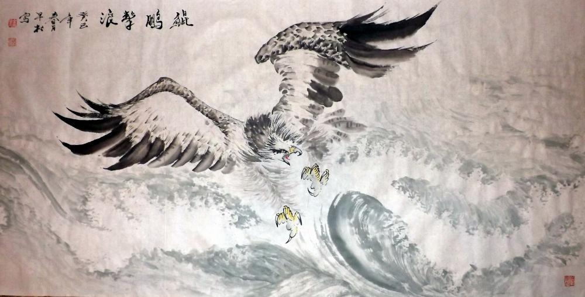
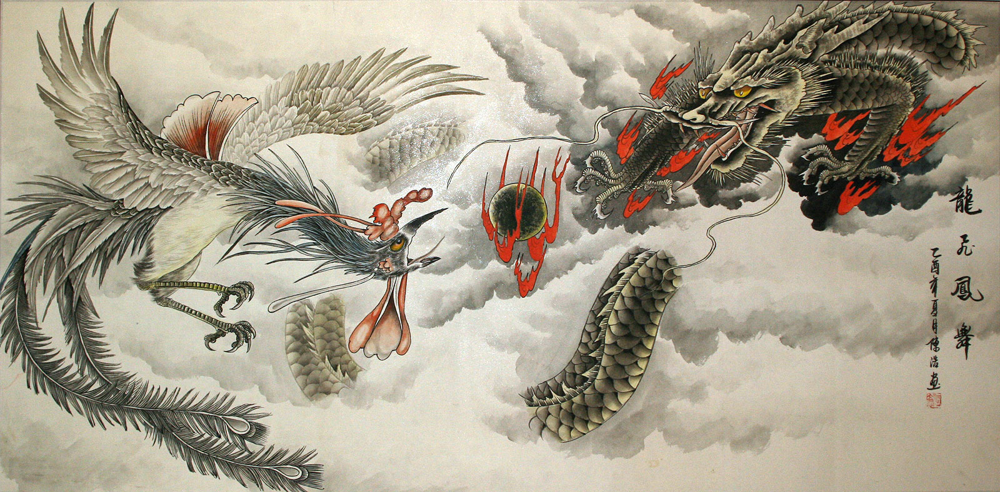
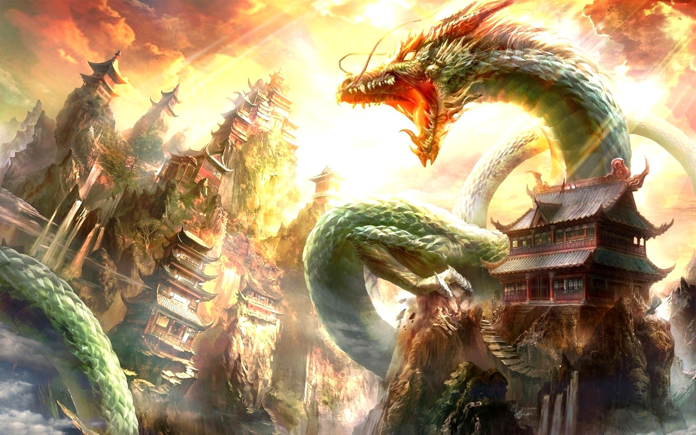
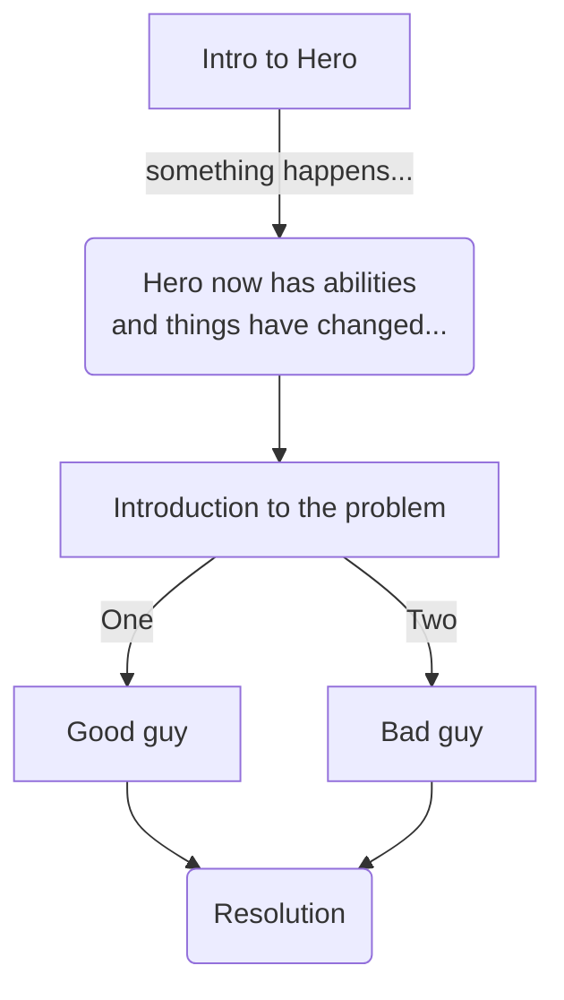

# Overview

## Synopsis
!!! info " "
    _This is a compilation of notes and thoughts over time and creativity.   What would capture the interest of people where I could write my stories and they would be, not only welcomed, but sought after._

## Authors I follow
Here's some authors I follow:

1.  William D. Arand[^1]
    * _William D Arand is a GameLit author best known for his unique stories. The talented author holds a day job that takes care of his bills and only writes in his free time. However, he has managed to create an impressive readership, and currently, he has over 20 published works to his name._
1.  Daniel Schinhofen[^2]
    * _The American writer Daniel Schinhofen is an extremely well regarded author within his particular field, largely concerning himself with gaming in fiction. This is where literature role-playing games, or LITRPG as it’s more commonly known, comes in, making for an interactive reading experience for his audience._
1.  Michael Anderle[^3]
    * _Michael Anderle is a noteworthy author hailing from America, who is famous for writing science fiction, paranormal, and fantasy books. He is particularly well known for writing and publishing the Kurtherian Gambit book series. Author Anderle was born in the year 1967 in Houston, Texas._
1.  Jim Butcher[^4]
    * _Well known fantasy author Jim Butcher is highly regarded thanks to his popular series of novels ‘The Dresden Files’ as well as the ‘Codex Alera’ saga. All this has helped secure him a place as a New York Times best-selling author._

## What type of Protagonist & Situation
1.  Pure Magical
    1.  _This character has gained some degree of magical ability or knowledge, outside of the norm for current reality._
1.  Pseudo-Magical (via Technology)
    1.  _A technology-based ability that's appears so advanced that an outsider would mistakenly conclude it could be magically based. ie. Teletechnics are an example of this.[^5]_
1.  Pure Technology
    1.  _An ability that showcased by some type of technology attached or assigned to the user, such as some type of futuristic armor or weapon._

## Time Period
1.  Is this based on current time period now (_ie. year 2021_)
1.  Is this based on some ancient time period (_ie. pre-renaissance and musket, 14th Century_)
1.  Is there some other type of Steampunk-variable time period, or some type of blend?

## What is the Conflict / Resolution that needs to be handled?
1.  No conflict or resolution required.    You are just lost in the sauce.
1.  Prophetic based structure - somehow you are the chosen one to fulfill the prophecy and end the bad guys.
1.  Escaping something else and decide to take a stand here and now.

!!! quote "Thoughts on Stupid People"
    Genius has limits, Stupidity does not

## Inspiring Images

## Flow of what happens...

## Footnotes
[^1]: Amazon Kindle Page: https://www.amazon.com/William-D.-Arand/e/B01AY7PSG4?ref=dbs_a_def_rwt_sims_vu00_r0_c0
[^2]: Amazon Kindle Page: https://www.amazon.com/Daniel-Schinhofen/e/B01LXQWPZA?ref=dbs_a_def_rwt_sims_vu00_r0_c1
[^3]: Amazon Kindle Page: https://www.amazon.com/Michael-Anderle/e/B017J2WANQ?ref=sr_ntt_srch_lnk_2&qid=1614555568&sr=1-2
[^4]: Amazon Kindle Page: https://www.amazon.com/Jim-Butcher/e/B001H6U718?ref=sr_ntt_srch_lnk_1&qid=1614549936&sr=1-1
[^5]: https://powerlisting.fandom.com/wiki/Teletechnics
