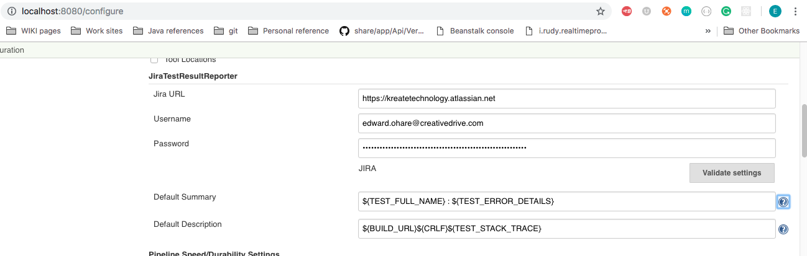
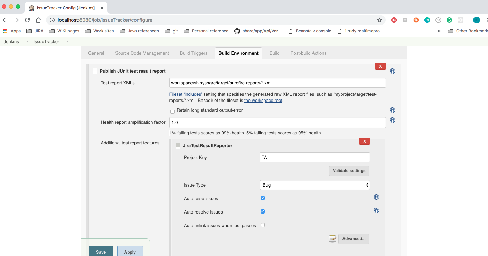
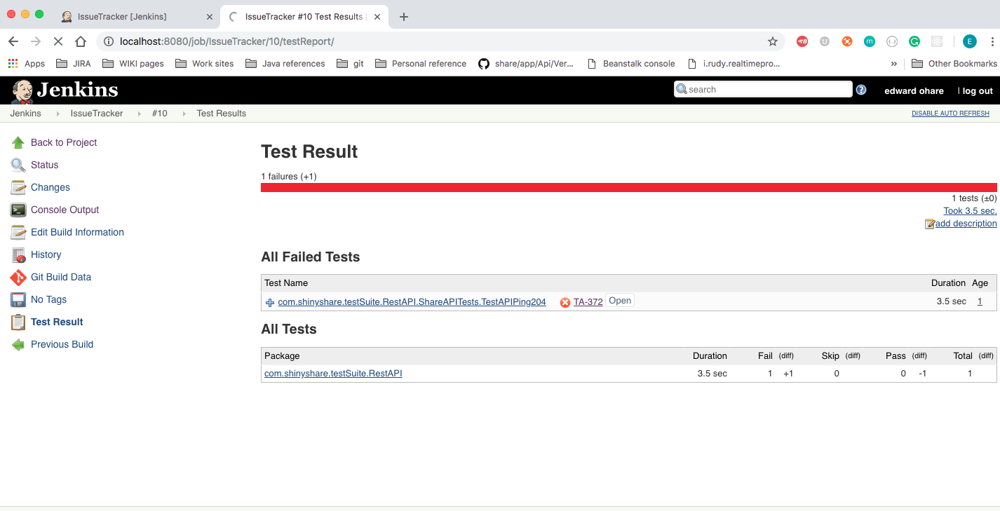

The Continuous Integration (CI) process, in it's most basic terms, is a process that allows the Jenkins deployment server to communicate with the JIRA ticket system to create, transition, and update tickets based on the results of both code deployments and automation test results.

This is accomplished through the use of the ***JIRA Issue Updater Plugin***[^1] and the ***Jira Test Result Reporter Plugin***[^2].

##Schema, Standardization, and Planning
The way the plugins work is by using an established generalized schema structure (ie. Deployment ticket are found in Project 'A', ticket will be created in Project 'B', tickets that need to be commented on can be found with JQL Query 'C', etc).   

All Tickets that need to be migrated and/or commented on, need to follow an established workflow.   Generally speaking, any deviation from the workflow, and the plugins will no longer be able to edit or comment on tickets.  So its important to clearly establish rules for both ticket migration and ticket creation.

##JIRA Issue Updater plugin
This plugin is virtually self contained.   When configured, the plugin logs into the JIRA ticket system with an instance-defined user[^3], and gathers the list of tickets to be updated.   This is accomplished by a user-defined JQL that is embedded within the job.   The tickets returned by the JQL query are then:

1. Transitioned to the state defined in the Plugin
1. Comments are added to the tickets as a pre-defined message

At this time, there is a known bug for updating any other pre-defined fields in the JIRA ticket (with the exclusion of custom fields).   Fields such as Resolution and Labels are not working with the plugin at this time.  (There are however workarounds for this that are being investigated)

##JIRA Test Result Reporter Plugin
The JIRA Test results reporter is a tool for both publishing test results and automatically creating tickets if a test fails or throws an exception.   

The tools requires a global setting configuration:

Within the job, the plugin requires the location of the test results XML file [for instance.  The Share project results would be located at: */workspace/shinyshare/target/surefire-reports/* directory]

Additionally, on a test failure, you can configure the plugin to create a ticket with the specified Project key, and Issue type.    

The options for 'Auto raise issues' links the ticket to the test result, and 'Auto resolve issues' will migrate the ticket to a RESOLVED whenever the test passes on a future run.

Here's an example of the Test Results with a linked ticket that was created by the plugin

An example and details of the ticket created by the plugin can be found here: [https://kreatetechnology.atlassian.net/browse/TA-372](https://kreatetechnology.atlassian.net/browse/TA-372)

[^1]: https://wiki.jenkins.io/display/JENKINS/Jira+Issue+Updater+Plugin
[^2]: https://wiki.jenkins.io/display/JENKINS/JiraTestResultReporter-plugin
[^3]: The user defined for the plugin is local and specific to that job only.  The plugin requires you to enter a user's credentials for each job that the plugin is used for.
