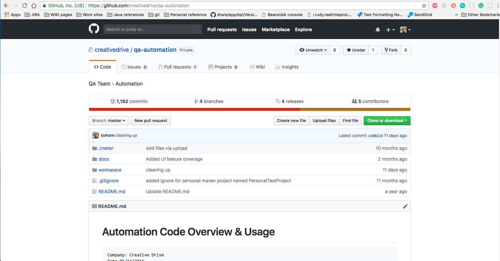

## Version Control System
All automation files shall be placed in our distributed version control system under [Git](https://www.atlassian.com/git/tutorials/what-is-git).  

Every dev and QA engineer has a working copy of the code and full change history on their local machine as well as available via [github.com](https://github.com) at [https://github.com/creativedrive/qa-automation](https://github.com/creativedrive/qa-automation) .

## Branching and Pull Requests
Additionally, QA automation development shall follow the [Git Flow](https://www.atlassian.com/git/tutorials/comparing-workflows/gitflow-workflow).
Code that is tested and ready to be distributed to the team shall be merged, tagged, and pushed to the MASTER branch.

An excellent visual resource for understanding how the git flow process works can be found here: [https://danielkummer.github.io/git-flow-cheatsheet/](https://danielkummer.github.io/git-flow-cheatsheet/).

QA Engineers will start a new feature branch from the 'develop' branch by running the command `git flow feature start FEATURE`.  Feature branch names are recommended to be lowercase but that is not strictly enforced at this time.  

When a feature is finished, a pull request shall be initiated via the github portal so that it may be reviewed before publishing.
